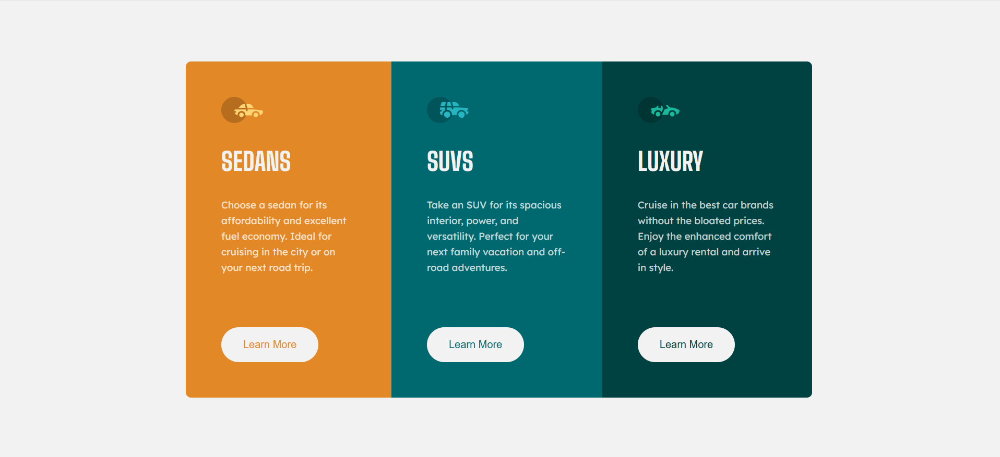

# Frontend Mentor - 3-column preview card component solution

This is a solution to the [3-column preview card component challenge on Frontend Mentor](https://www.frontendmentor.io/challenges/3column-preview-card-component-pH92eAR2-). Frontend Mentor challenges help you improve your coding skills by building realistic projects.

## Table of contents

- [Overview](#overview)
  - [Screenshot](#screenshot)
  - [Links](#links)
- [My process](#my-process)
  - [Built with](#built-with)
  - [What I learned](#what-i-learned)
- [Author](#author)

## Overview

This project is a responsive 3-column preview card component built with HTML and SCSS. It showcases three distinct card sections with unique content and colors, designed using Flexbox, media queries, and custom properties for a clean and modern layout.

### Screenshot

### Links

- Project link: [Stats Preview Card](https://github.com/ayfersahinn/frontend-mentor-projects/tree/main/3-column-preview-card-component)
- Visit Site: [Stats Preview Card](https://ayfersahinn.github.io/frontend-mentor-projects/3-column-preview-card-component)

## My process

### Built with

- Semantic HTML5 markup
- SCSS with variables and nesting (for maintainable and modular styling)
- Flexbox
- CSS Grid
- Media queries and other responsive techniques

### What I learned

I learned how the align-items: stretch property in Flexbox automatically makes flex items match the container’s height, which helped me keep all cards evenly aligned in the layout.

## Author

- Frontend Mentor - [@ayfersahinn](https://www.frontendmentor.io/profile/ayfersahinn)
