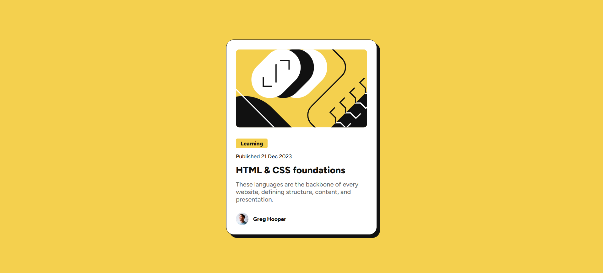

# Frontend Mentor - Blog preview card solution

This is a solution to the [Blog preview card challenge on Frontend Mentor](https://www.frontendmentor.io/challenges/blog-preview-card-ckPaj01IcS). Frontend Mentor challenges help you improve your coding skills by building realistic projects.

## Table of contents

- [Overview](#overview)
  - [Screenshot](#screenshot)
  - [Links](#links)
- [My process](#my-process)
  - [Built with](#built-with)
  - [What I learned](#what-i-learned)
- [Author](#author)

## Overview

I designed the Blog Preview Card from Frontend Mentor. I used the Figma design as a reference and built the project with responsive layout. I practiced both Flexbox and Grid to make the card work well on different screen sizes.

### Screenshot

### Links

- Project link: [social-links-profile-main](https://github.com/ayfersahinn/frontend-mentor-projects/tree/main/blog-preview-card)
- Visit Site: [Social Links Profile](https://ayfersahinn.github.io/frontend-mentor-projects/blog-preview-card/)

## My process

### Built with

- Semantic HTML5 markup
- CSS custom properties
- Flexbox and CSS Grid
- Responsive design based on Figma design

### What I learned

Through this project, I learned how to use Flexbox and CSS Grid to build a responsive layout and I practiced working with Figma designs and turning them into code. In addition, I improved my responsive design skills for small and large screens.

## Author

- Frontend Mentor - [@ayfersahinn](https://www.frontendmentor.io/profile/ayfersahinn)
