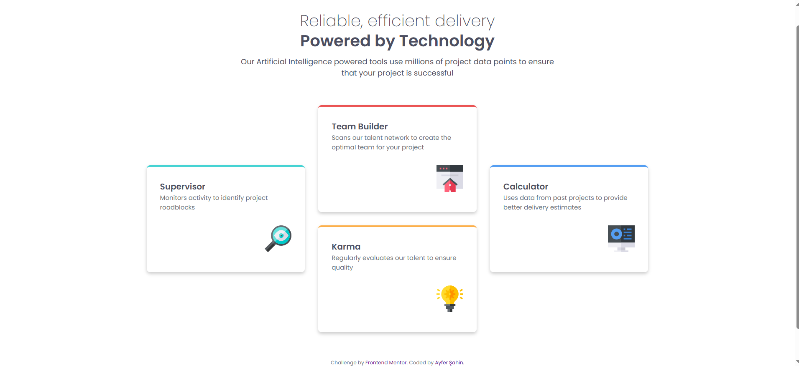

# Frontend Mentor - Four card feature section solution

This is a solution to the [Four card feature section challenge on Frontend Mentor](https://www.frontendmentor.io/challenges/four-card-feature-section-weK1eFYK). Frontend Mentor challenges help you improve your coding skills by building realistic projects.

## Table of contents

- [Overview](#overview)
  - [Screenshot](#screenshot)
  - [Links](#links)
- [My process](#my-process)
  - [Built with](#built-with)
  - [What I learned](#what-i-learned)
- [Author](#author)

## Overview

This project is a responsive Four Card Feature Section built using HTML & SCSS. It replicates the design from the Frontend Mentor challenge, focusing on flexible grid layout, responsive design, and clean styling. The section adapts seamlessly to different screen sizes, ensuring a user-friendly experience on both mobile and desktop devices.

### Screenshot

### Links

- Project link: [Four Card Feature](https://github.com/ayfersahinn/frontend-mentor-projects/tree/main/four-card-feature-section)
- Visit Site: [Four Card Feature](https://ayfersahinn.github.io/frontend-mentor-projects/four-card-feature-section)

## My process

### Built with

- Semantic HTML5 markup
- SCSS (Sass)
- Flexbox
- CSS Grid
- Responsive design

### What I learned

Through this project, I improved my skills in creating responsive layouts using CSS Grid and Flexbox, structured semantic HTML for better accessibility, and leveraged SCSS (Sass) along with CSS custom properties for cleaner and more maintainable styles. I also gained experience in mobile-first design, ensuring that components adapt smoothly across different screen sizes.

## Author

- Frontend Mentor - [@ayfersahinn](https://www.frontendmentor.io/profile/ayfersahinn)
