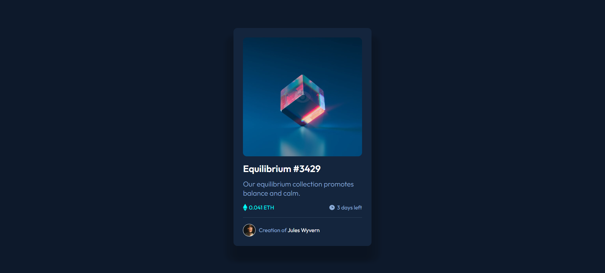

# Frontend Mentor - NFT preview card component solution

This is a solution to the [NFT preview card component challenge on Frontend Mentor](https://www.frontendmentor.io/challenges/nft-preview-card-component-SbdUL_w0U). Frontend Mentor challenges help you improve your coding skills by building realistic projects.

## Table of contents

- [Overview](#overview)
  - [Screenshot](#screenshot)
  - [Links](#links)
- [My process](#my-process)
  - [Built with](#built-with)
  - [What I learned](#what-i-learned)
- [Author](#author)

## Overview

This project is a responsive NFT Preview Card Component built using HTML and SCSS. he design includes hover effects with a semi-transparent overlay and icon on the image. The component adapts to different screen sizes without media queries, using flexible units and CSS functions like clamp() or min().

### Screenshot

### Links

- Project link: [social-links-profile-main](https://github.com/ayfersahinn/frontend-mentor-projects/tree/main/nft-preview-card-component-main)
- Visit Site: [Social Links Profile](https://ayfersahinn.github.io/frontend-mentor-projects/nft-preview-card-component-main/)

## My process

### Built with

- Semantic HTML5 markup
- SCSS
- Flexbox for layout and alignment
- Responsive design using flexible units (clamp(), %, vw)

### What I learned

Through this project, I improved my skills in creating semantic HTML structures, building responsive layouts, and adding interactive hover effects using SCSS. I also gained experience in styling components with CSS/SCSS, including shadows, borders, and overlay effects, while translating a Figma design into a functional web component.

## Author

- Frontend Mentor - [@ayfersahinn](https://www.frontendmentor.io/profile/ayfersahinn)
