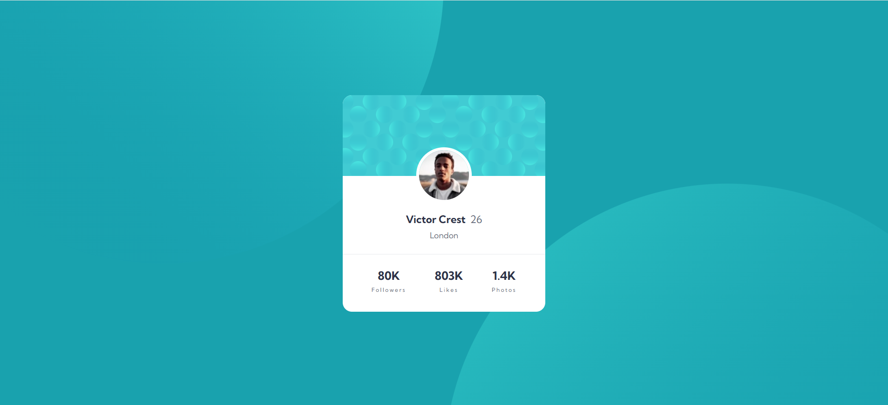

# Frontend Mentor - Profile card component solution

This is a solution to the [Profile card component challenge on Frontend Mentor](https://www.frontendmentor.io/challenges/profile-card-component-cfArpWshJ). Frontend Mentor challenges help you improve your coding skills by building realistic projects.

## Table of contents

- [Overview](#overview)
  - [Screenshot](#screenshot)
  - [Links](#links)
- [My process](#my-process)
  - [Built with](#built-with)
  - [What I learned](#what-i-learned)
- [Author](#author)

## Overview

This Profile Card Component was built using HTML and SCSS, fully responsive for different screen sizes. Modern CSS techniques like Flexbox and Grid were used to ensure proper layout and styling. The design includes decorative background SVGs, carefully positioned for both large and small screens.

### Screenshot

### Links

- Project link: [Profile Card Component](https://github.com/ayfersahinn/frontend-mentor-projects/tree/main/profile-card-component)
- Visit Site: [Profile Card Component](https://ayfersahinn.github.io/frontend-mentor-projects/profile-card-component)

## My process

### Built with

- Semantic HTML5 markup
- SCSS (Sass) for modular and maintainable styling
- Flexbox
- CSS Grid

### What I learned

Through this project, I improved my skills in creating responsive UI components using modern CSS techniques. It helped me practice precise layout control, responsive design principles, and handling decorative background elements effectively. Projects like this strengthen my front-end development skills and attention to design detail.

## Author

- Frontend Mentor - [@ayfersahinn](https://www.frontendmentor.io/profile/ayfersahinn)
