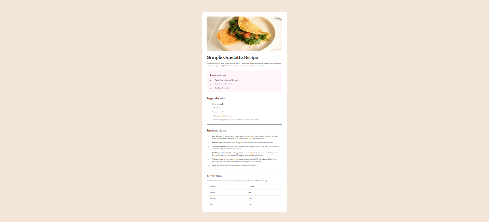

# Frontend Mentor - Recipe page solution

This is a solution to the [Recipe page challenge on Frontend Mentor](https://www.frontendmentor.io/challenges/recipe-page-KiTsR8QQKm). Frontend Mentor challenges help you improve your coding skills by building realistic projects.

## Table of contents

- [Overview](#overview)
  - [Screenshot](#screenshot)
  - [Links](#links)
- [My process](#my-process)
  - [Built with](#built-with)
  - [What I learned](#what-i-learned)
- [Author](#author)

## Overview

This recipe page was built using semantic HTML5 and CSS. The layout is fully responsive, ensuring it adapts smoothly to different screen sizes.

### Screenshot

### Links

- Project link: [Recipe Page](https://github.com/ayfersahinn/frontend-mentor-projects/tree/main/recipe-page-main)
- Visit Site: [Recipe Page](https://ayfersahinn.github.io/frontend-mentor-projects/recipe-page-main)

## My process

### Built with

- Semantic HTML5 markup
- CSS custom properties (for maintainable styling)
- Flexbox
- CSS Grid
- Media queries and other responsive techniques

### What I learned

- How to build a responsive recipe card layout using CSS Grid and Flexbox.

- How to manage spacing, padding, and margins effectively for different screen sizes.

- Using media queries and CSS custom properties to make a design adapt smoothly to mobile, tablet, and desktop.

- How to structure semantic HTML5 for better accessibility and maintainability.

## Author

- Frontend Mentor - [@ayfersahinn](https://www.frontendmentor.io/profile/ayfersahinn)
