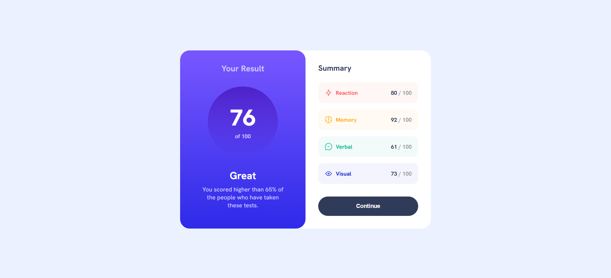

# Frontend Mentor - Results summary component solution

This is a solution to the [Results summary component challenge on Frontend Mentor](https://www.frontendmentor.io/challenges/results-summary-component-CE_K6s0maV). Frontend Mentor challenges help you improve your coding skills by building realistic projects.

## Table of contents

- [Overview](#overview)
  - [Screenshot](#screenshot)
  - [Links](#links)
- [My process](#my-process)
  - [Built with](#built-with)
  - [What I learned](#what-i-learned)
- [Author](#author)

## Overview

This project is a responsive Results Summary Component built with HTML and SCSS. It displays a user's score with a gradient background and a summary section for different categories. The goal of the challenge was to practice layout design, flexbox usage, gradients, and smooth hover effects.

### Screenshot

### Links

- Project link: [Results Summary Component](https://github.com/ayfersahinn/frontend-mentor-projects/tree/main/results-summary-component)
- Visit Site: [Results Summary Component](https://ayfersahinn.github.io/frontend-mentor-projects/results-summary-component)

## My process

### Built with

- Semantic HTML5 markup
- SCSS (for better structure and reusability)
- Flexbox
- CSS Grid
- Media queries and other responsive techniques

### What I learned

While building this project, I improved my understanding of flexbox and CSS grid layouts for responsive design. I also learned how to use SCSS to organize styles more efficiently and apply CSS custom properties for consistent color and typography management. Additionally, I practiced creating smooth hover transitions and using gradient backgrounds effectively.

## Author

- Frontend Mentor - [@ayfersahinn](https://www.frontendmentor.io/profile/ayfersahinn)
