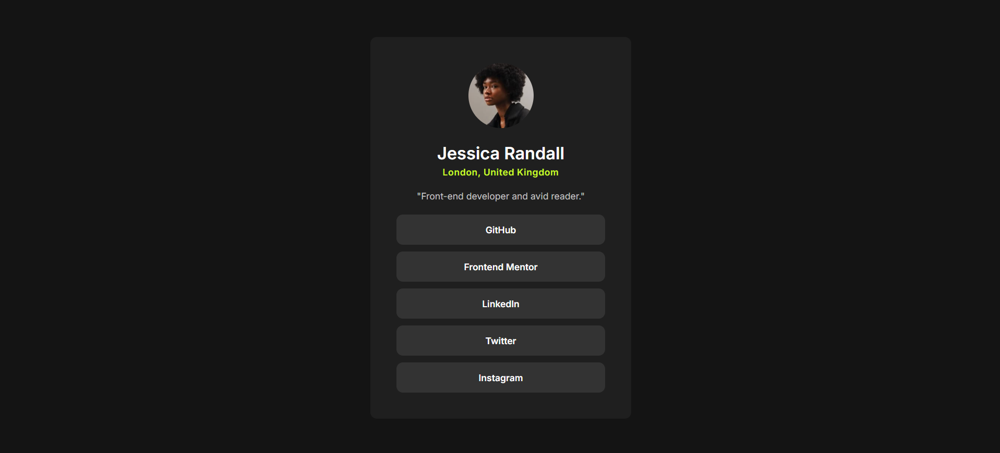

# Frontend Mentor - Social links profile solution

This is a solution to the [Social links profile challenge on Frontend Mentor](https://www.frontendmentor.io/challenges/social-links-profile-UG32l9m6dQ). Frontend Mentor challenges help you improve your coding skills by building realistic projects.

## Table of contents

- [Overview](#overview)
  - [Screenshot](#screenshot)
  - [Links](#links)
- [My process](#my-process)
  - [Built with](#built-with)
  - [What I learned](#what-i-learned)
- [Author](#author)

## Overview

This is a responsive social profile card built with HTML and CSS. It displays a user’s profile photo, name, location, short bio, and social media links.

### Screenshot

### Links

- Project link: [social-links-profile-main]()
- Visit Site: [Social Links Profile]()

## My process

### Built with

- Semantic HTML5 markup
- CSS custom properties
- Flexbox
- Responsive design

### What I learned

Through this project, I practiced structuring a simple webpage using semantic HTML and modern CSS techniques.

I improved my understanding of:

- How to build a responsive profile card that works on mobile and desktop.
- Using Flexbox to center content both vertically and horizontally.
- Applying semantic HTML5 elements.
- Implementing media queries to adjust layout and typography for smaller screens

## Author

- Frontend Mentor - [@ayfersahinn](https://www.frontendmentor.io/profile/ayfersahinn)
