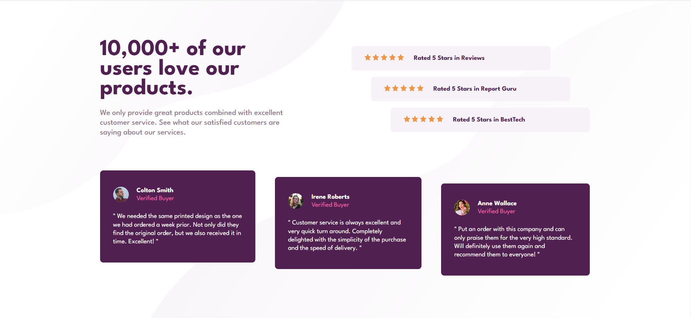

# Frontend Mentor - Social proof section solution

This is a solution to the [Social proof section challenge on Frontend Mentor](https://www.frontendmentor.io/challenges/social-proof-section-6e0qTv_bA). Frontend Mentor challenges help you improve your coding skills by building realistic projects.

## Table of contents

- [Overview](#overview)
  - [Screenshot](#screenshot)
  - [Links](#links)
- [My process](#my-process)
  - [Built with](#built-with)
  - [What I learned](#what-i-learned)
- [Author](#author)

## Overview

This project focuses on building a responsive layout using HTML and CSS (SCSS). The goal was to create a visually appealing section that showcases customer reviews and ratings across different screen sizes. The design adapts smoothly from mobile to desktop, maintaining clean alignment, spacing, and consistent typography.

### Screenshot

### Links

- Project link: [Social Proof Section](https://github.com/ayfersahinn/frontend-mentor-projects/tree/main/social-proof-section)
- Visit Site: [Social Proof Section](https://ayfersahinn.github.io/frontend-mentor-projects/social-proof-section)

## My process

### Built with

- Semantic HTML5 markup
- SCSS for modular and maintainable styling
- CSS custom properties
- Flexbox
- CSS Grid

### hat I learnedW

Through this project, I improved my understanding of flexbox and responsive design principles. I learned how to position multiple background images effectively using CSS and how to adjust layouts for different screen sizes. I also practiced writing clean and structured SCSS, which helped me organize styles more efficiently.

## Author

- Frontend Mentor - [@ayfersahinn](https://www.frontendmentor.io/profile/ayfersahinn)
