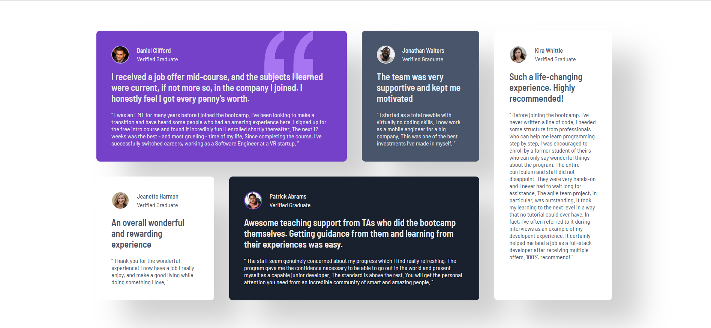

# Frontend Mentor - Testimonials grid section solution

This is a solution to the [Testimonials grid section challenge on Frontend Mentor](https://www.frontendmentor.io/challenges/testimonials-grid-section-Nnw6J7Un7). Frontend Mentor challenges help you improve your coding skills by building realistic projects.

## Table of contents

- [Overview](#overview)
  - [Screenshot](#screenshot)
  - [Links](#links)
- [My process](#my-process)
  - [Built with](#built-with)
  - [What I learned](#what-i-learned)
- [Author](#author)

## Overview

This project is a responsive testimonials grid section built using HTML and SCSS. It displays multiple user testimonials in a clean and organized grid layout. The main focus was on practicing CSS Grid, responsive design techniques, and creating a visually balanced layout that adapts well to different screen sizes.

### Screenshot

### Links

- Project link: [Testimonials Grid Section](https://github.com/ayfersahinn/frontend-mentor-projects/tree/main/testimonials-grid-section)
- Visit Site: [Testimonials Grid Section](https://ayfersahinn.github.io/frontend-mentor-projects/testimonials-grid-section)

## My process

### Built with

- Semantic HTML5 markup
- CSS custom properties
- SCSS (Sass)
- Flexbox
- CSS Grid

### What I learned

While working on this project, I improved my understanding of CSS Grid and how to create complex layouts that stay responsive across different screen sizes. I learned how to effectively use Flexbox for aligning content within grid items and how to combine both layout systems efficiently.

## Author

- Frontend Mentor - [@ayfersahinn](https://www.frontendmentor.io/profile/ayfersahinn)
